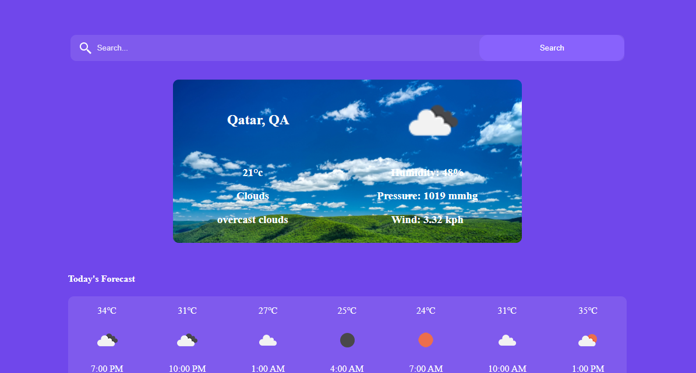

# Weather-App

This is a weather app built with ReactJs. 

## Table of contents

- [Overview](#overview)
  - [The challenge](#the-challenge)
  - [Screenshot](#screenshot)
  - [Links](#links)
- [My process](#my-process)
  - [Built with](#built-with)
  - [What I learned](#what-i-learned)
  - [Useful resources](#useful-resources)
- [To use](#usage)

## Overview

### The challenge

Users should be able to:

- View the optimal layout for the site depending on their device's screen size
- View current weather of their location
- View weather forecast 3 hourly

### Screenshot




### Links

- Solution URL: (https://github.com/faozziyyah/react-weather-app)
- Live Site URL: (https://view-your-weather.netlify.app/)
- Github Pages: (https://faozziyyah.github.io/react-weather-app/)

## My process

### Built with

- JSX
- CSS modules
- Flexbox
- [React](https://reactjs.org/) - React: JS library

### What I learned

- How to use weather api in React
- React state and hooks

```React.js
fetch(`${api.base}forecast?q=${query}&cnt=5&units=metric&APPID=${api.key}`)
              .then(data => data.json())
              .then(forecastData => {
                  setForecast(forecastData.list);
                  console.log(forecastData.list);
              });
```

### Useful resources

- [Weather API](https://openweathermap.org/forecast5) - Open weather map API documentation

## Usage

To use this app, you can clone this repo to your local machine, then yarn install to install dependencies and yarn start to view live on your local host.
